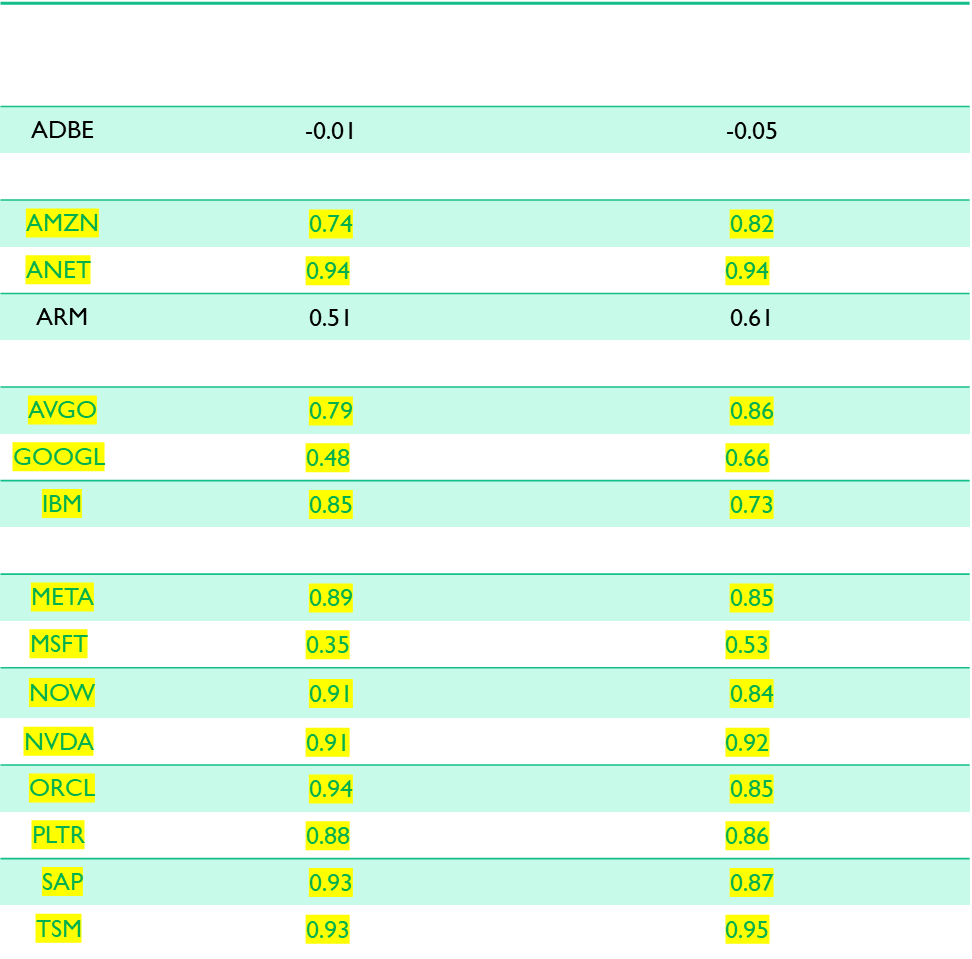

readme_content = """
# AI Stocks Analysis

This project analyzes the performance and correlation of top AI stocks using various data analysis and visualization techniques. The analysis includes fetching stock data, cleansing it, performing correlation analysis, and visualizing technical indicators.

## Table of Contents
- [Libraries Used](#libraries-used)
- [Stock List](#stock-list)
- [Data Fetching](#data-fetching)
- [Data Cleansing](#data-cleansing)
- [Correlation Analysis](#correlation-analysis)
- [Performance Analysis](#performance-analysis)
- [Technical Indicators](#technical-indicators)
- [Forecasting](#forecasting)
- [Visualization](#visualization)

## Libraries Used
- json
- requests
- pandas
- numpy
- matplotlib.pyplot
- mplfinance
- scipy.stats
- prophet

## Stock List
The project analyzes the following AI stocks:
- Nvidia Corporation (NVDA)
- Microsoft Corporation (MSFT)
- Alphabet Inc. (GOOGL)
- Amazon.com, Inc. (AMZN)
- Meta Platforms, Inc. (META)
- Taiwan Semiconductor Manufacturing Company Limited (TSM)
- ASML Holding N.V. (ASML)
- Adobe Inc. (ADBE)
- International Business Machines Corporation (IBM)
- Arista Networks Inc. (ANET)
- Broadcom Inc. (AVGO)
- Oracle Corporation (ORCL)
- SAP SE (SAP)
- Accenture plc (ACN)
- ServiceNow, Inc. (NOW)
- Intel Inc. (INTC)
- Advanced Micro Devices, Inc. (AMD)
- Palantir Technologies Inc. (PLTR)
- Arm Holdings plc (ARM)

## Data Fetching
Data is fetched from the TradeStation API using an access token. The data includes historical stock prices for the AI stocks and market indices (SPY and QQQ).

## Data Cleansing
The fetched data is cleansed by:
- Selecting specific columns
- Converting data types
- Setting the timestamp as the index
- Renaming columns

## Correlation Analysis
The project calculates the correlation of AI stocks with SPY and QQQ market indices and between the AI stocks themselves.

## Performance Analysis
The project calculates the 52-week and 12-week performance of the AI stocks.

## Technical Indicators
The project calculates and plots various technical indicators for the AI stocks, including:
- 50-day and 200-day moving averages
- Average True Range (ATR)
- Relative Strength Index (RSI)

## Forecasting
The project uses the Prophet library to forecast the future stock prices for the AI stocks.

## Visualization
The project includes various visualizations such as:
- Closing price plots
- Candlestick charts
- Performance charts
- Technical indicator plots

## How to Run
1. Ensure you have all the required libraries installed.
2. Run the cells in the Jupyter Notebook in order to fetch, cleanse, analyze, and visualize the data.

## Some Results

### Market Correlation

### Technical Analysis

### Stock Prediction

## Conclusion 
After combing through the data, we have found that it would benefit the customer to look at investing in NVDA, ORCL, ANET, AVGO, and SAP as they have a correlation above 0.9. According to our models these stocks are all predicted to trend upward in the 12 week and 52 week forecasts. 
If you take out the consideration of correalations above 0.9, the recomended stocks are then; AMZN, NVDA, META, TSM, ORCL, ANET, AVGO, NOW, SAP, and PLTR. These are trending up as well, they just don't rely heavily on each other. 
We found that it would not be benefitial to invest in MSFT, GOOGL, or ARM as these are too volatil and/or trend down in the 12 week and 52 week predictions. 
