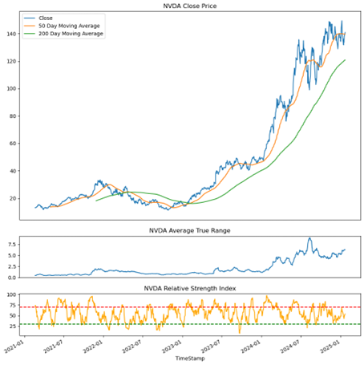
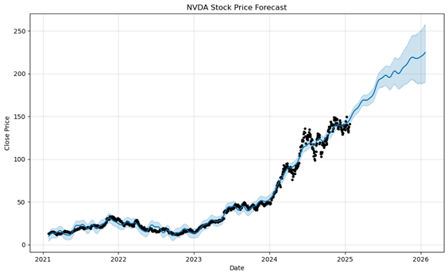

readme_content = """
# AI Stocks Analysis

This project analyzes the performance and correlation of top AI stocks using various data analysis and visualization techniques. The analysis includes fetching stock data, cleansing it, performing correlation analysis, and visualizing technical indicators.

## Table of Contents
- [Libraries Used](#libraries-used)
- [Stock List](#stock-list)
- [Data Fetching](#data-fetching)
- [Data Cleansing](#data-cleansing)
- [Correlation Analysis](#correlation-analysis)
- [Performance Analysis](#performance-analysis)
- [Technical Indicators](#technical-indicators)
- [Forecasting](#forecasting)
- [Visualization](#visualization)

## Libraries Used
- json
- requests
- pandas
- numpy
- matplotlib.pyplot
- mplfinance
- scipy.stats
- prophet

## Stock List
The project analyzes the following AI stocks:
- Nvidia Corporation (NVDA)
- Microsoft Corporation (MSFT)
- Alphabet Inc. (GOOGL)
- Amazon.com, Inc. (AMZN)
- Meta Platforms, Inc. (META)
- Taiwan Semiconductor Manufacturing Company Limited (TSM)
- ASML Holding N.V. (ASML)
- Adobe Inc. (ADBE)
- International Business Machines Corporation (IBM)
- Arista Networks Inc. (ANET)
- Broadcom Inc. (AVGO)
- Oracle Corporation (ORCL)
- SAP SE (SAP)
- Accenture plc (ACN)
- ServiceNow, Inc. (NOW)
- Intel Inc. (INTC)
- Advanced Micro Devices, Inc. (AMD)
- Palantir Technologies Inc. (PLTR)
- Arm Holdings plc (ARM)

## Data Fetching
Data is fetched from the TradeStation API using an access token. The data includes historical stock prices for the AI stocks and market indices (SPY and QQQ).

## Data Cleansing
The fetched data is cleansed by:
- Selecting specific columns
- Converting data types
- Setting the timestamp as the index
- Renaming columns

## Correlation Analysis
The project calculates the correlation of AI stocks with SPY and QQQ market indices and between the AI stocks themselves.

## Performance Analysis
The project calculates the 52-week and 12-week performance of the AI stocks.

## Technical Indicators
The project calculates and plots various technical indicators for the AI stocks, including:
- 50-day and 200-day moving averages
- Average True Range (ATR)
- Relative Strength Index (RSI)

## Forecasting
The project uses the Prophet library to forecast the future stock prices for the AI stocks.

## Visualization
The project includes various visualizations such as:
- Closing price plots
- Candlestick charts
- Performance charts
- Technical indicator plots

## How to Run
1. Ensure you have all the required libraries installed.
2. Run the cells in the Jupyter Notebook in order to fetch, cleanse, analyze, and visualize the data.

## Some Results

### Market Correlation

<table id="T_844f4">
  <thead>
    <tr>
      <th class="blank level0" >&nbsp;</th>
      <th id="T_844f4_level0_col0" class="col_heading level0 col0" >Correlation with SPY</th>
      <th id="T_844f4_level0_col1" class="col_heading level0 col1" >Correlation with QQQ</th>
    </tr>
    <tr>
      <th class="index_name level0" >Stock</th>
      <th class="blank col0" >&nbsp;</th>
      <th class="blank col1" >&nbsp;</th>
    </tr>
  </thead>
  <tbody>
    <tr>
      <th id="T_844f4_level0_row0" class="row_heading level0 row0" >ACN</th>
      <td id="T_844f4_row0_col0" class="data row0 col0" >0.80</td>
      <td id="T_844f4_row0_col1" class="data row0 col1" >0.66</td>
    </tr>
    <tr>
      <th id="T_844f4_level0_row1" class="row_heading level0 row1" >ADBE</th>
      <td id="T_844f4_row1_col0" class="data row1 col0" >-0.04</td>
      <td id="T_844f4_row1_col1" class="data row1 col1" >-0.08</td>
    </tr>
    <tr>
      <th id="T_844f4_level0_row2" class="row_heading level0 row2" >AMD</th>
      <td id="T_844f4_row2_col0" class="data row2 col0" >-0.46</td>
      <td id="T_844f4_row2_col1" class="data row2 col1" >-0.40</td>
    </tr>
    <tr>
      <th id="T_844f4_level0_row3" class="row_heading level0 row3" >AMZN</th>
      <td id="T_844f4_row3_col0" class="data row3 col0" >0.75</td>
      <td id="T_844f4_row3_col1" class="data row3 col1" >0.83</td>
    </tr>
    <tr>
      <th id="T_844f4_level0_row4" class="row_heading level0 row4" >ANET</th>
      <td id="T_844f4_row4_col0" class="data row4 col0" >0.94</td>
      <td id="T_844f4_row4_col1" class="data row4 col1" >0.94</td>
    </tr>
    <tr>
      <th id="T_844f4_level0_row5" class="row_heading level0 row5" >ARM</th>
      <td id="T_844f4_row5_col0" class="data row5 col0" >0.52</td>
      <td id="T_844f4_row5_col1" class="data row5 col1" >0.62</td>
    </tr>
    <tr>
      <th id="T_844f4_level0_row6" class="row_heading level0 row6" >ASML</th>
      <td id="T_844f4_row6_col0" class="data row6 col0" >-0.69</td>
      <td id="T_844f4_row6_col1" class="data row6 col1" >-0.53</td>
    </tr>
    <tr>
      <th id="T_844f4_level0_row7" class="row_heading level0 row7" >AVGO</th>
      <td id="T_844f4_row7_col0" class="data row7 col0" >0.80</td>
      <td id="T_844f4_row7_col1" class="data row7 col1" >0.86</td>
    </tr>
    <tr>
      <th id="T_844f4_level0_row8" class="row_heading level0 row8" >GOOGL</th>
      <td id="T_844f4_row8_col0" class="data row8 col0" >0.49</td>
      <td id="T_844f4_row8_col1" class="data row8 col1" >0.67</td>
    </tr>
    <tr>
      <th id="T_844f4_level0_row9" class="row_heading level0 row9" >IBM</th>
      <td id="T_844f4_row9_col0" class="data row9 col0" >0.85</td>
      <td id="T_844f4_row9_col1" class="data row9 col1" >0.73</td>
    </tr>
    <tr>
      <th id="T_844f4_level0_row10" class="row_heading level0 row10" >INTC</th>
      <td id="T_844f4_row10_col0" class="data row10 col0" >-0.66</td>
      <td id="T_844f4_row10_col1" class="data row10 col1" >-0.54</td>
    </tr>
    <tr>
      <th id="T_844f4_level0_row11" class="row_heading level0 row11" >META</th>
      <td id="T_844f4_row11_col0" class="data row11 col0" >0.89</td>
      <td id="T_844f4_row11_col1" class="data row11 col1" >0.86</td>
    </tr>
    <tr>
      <th id="T_844f4_level0_row12" class="row_heading level0 row12" >MSFT</th>
      <td id="T_844f4_row12_col0" class="data row12 col0" >0.37</td>
      <td id="T_844f4_row12_col1" class="data row12 col1" >0.55</td>
    </tr>
    <tr>
      <th id="T_844f4_level0_row13" class="row_heading level0 row13" >NOW</th>
      <td id="T_844f4_row13_col0" class="data row13 col0" >0.91</td>
      <td id="T_844f4_row13_col1" class="data row13 col1" >0.85</td>
    </tr>
    <tr>
      <th id="T_844f4_level0_row14" class="row_heading level0 row14" >NVDA</th>
      <td id="T_844f4_row14_col0" class="data row14 col0" >0.91</td>
      <td id="T_844f4_row14_col1" class="data row14 col1" >0.92</td>
    </tr>
    <tr>
      <th id="T_844f4_level0_row15" class="row_heading level0 row15" >ORCL</th>
      <td id="T_844f4_row15_col0" class="data row15 col0" >0.94</td>
      <td id="T_844f4_row15_col1" class="data row15 col1" >0.85</td>
    </tr>
    <tr>
      <th id="T_844f4_level0_row16" class="row_heading level0 row16" >PLTR</th>
      <td id="T_844f4_row16_col0" class="data row16 col0" >0.88</td>
      <td id="T_844f4_row16_col1" class="data row16 col1" >0.86</td>
    </tr>
    <tr>
      <th id="T_844f4_level0_row17" class="row_heading level0 row17" >SAP</th>
      <td id="T_844f4_row17_col0" class="data row17 col0" >0.93</td>
      <td id="T_844f4_row17_col1" class="data row17 col1" >0.87</td>
    </tr>
    <tr>
      <th id="T_844f4_level0_row18" class="row_heading level0 row18" >TSM</th>
      <td id="T_844f4_row18_col0" class="data row18 col0" >0.93</td>
      <td id="T_844f4_row18_col1" class="data row18 col1" >0.95</td>
    </tr>
  </tbody>
</table>

### Technical Analysis

### Stock Prediction

## Conclusion 
After combing through the data, we have found that it would benefit the customer to look at investing in NVDA, ORCL, ANET, AVGO, and SAP as they have a correlation above 0.9. According to our models these stocks are all predicted to trend upward in the 12 week and 52 week forecasts. 
If you take out the consideration of correalations above 0.9, the recomended stocks are then; AMZN, NVDA, META, TSM, ORCL, ANET, AVGO, NOW, SAP, and PLTR. These are trending up as well, they just don't rely heavily on each other. 
We found that it would not be benefitial to invest in MSFT, GOOGL, or ARM as these are too volatil and/or trend down in the 12 week and 52 week predictions. 
